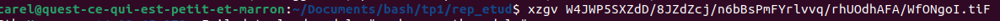

# tpbash

1.  il faut utilliser la commande `ls` afin de lister le contenu du dossier 

2.  il faut utiliser la commande `ls -l` car l'argument `-l` perme de lister dans un autre stylez qui montre également les permissions et les infos des fichiers/dossiers

3. il faut utilliser la commande `du -sh` la commande `du` sert a lire la taille des fichers du répertoire. l'argument `-s` permet de tout regrouper dans une seule valeur et l'argument `-h` permet que le resultat soit lisible par un humain

4. il faut utiliser la commande `du -ah` afin de lister tout les fichiers (avec l'argument `-a`) et de donner leur taille

5. il faut utilliser la commande `du -sh W4JWP5SXZdD/8JZdZcj/` car je suis déja dans le dossier rep_etu. Par conséquent, je réutillise la commande `du -sh`

6. cett earborescence contient des dossers et des fichiers .png ou .xnQ

7. il faut utiliser la commande `xzgv W4JWP5SXZdD/8JZdZcj/n6bBsPmFYrlvvq/rhUOdhAFA/WfONgoI.tiF` xzgv permet d'afficher l'image et celle ci représente un paysage de montagne.

8. cette image represente un apéro champetre. pour visualiser cette image, il fallait modifier les permissions avec `chmod u+r W4JWP5SXZdD/8JZdZcj/CFnTBOG/DkcEhnLR5N/iRuMJU.tIF ` puis la visualiser avec la commande `xzgv W4JWP5SXZdD/8JZdZcj/CFnTBOG/DkcEhnLR5N/iRuMJU.tIF `

9. les fichiers n'ont pas les mêmes droits. 

10. pour changer les permission, il faut utiliser `chmod u+(droit a rajouter) XXX ` qui permet de changer les permissions

11. pour deplacerun fichier, il faut utilliser `mv XXX YYY` 

12. pour copier un fichier, il faut utilliser `cp XXX YYY`

13. pour réaliser cette action, j'ai réalisé la commande `chmod 720 Keh9rsnOnNq58k/j2DaP/xZfdIHNXCGN/q6IOP766oaak/DMFxTMGER6.png; cp Keh9rsnOnNq58k/j2DaP/xZfdIHNXCGN/q6IOP766oaak/DMFxTMGER6.png /home/carel/Documents/bash/tp1/rep_etud; mv DMFxTMGER6.png toto.png;  ls -l`

